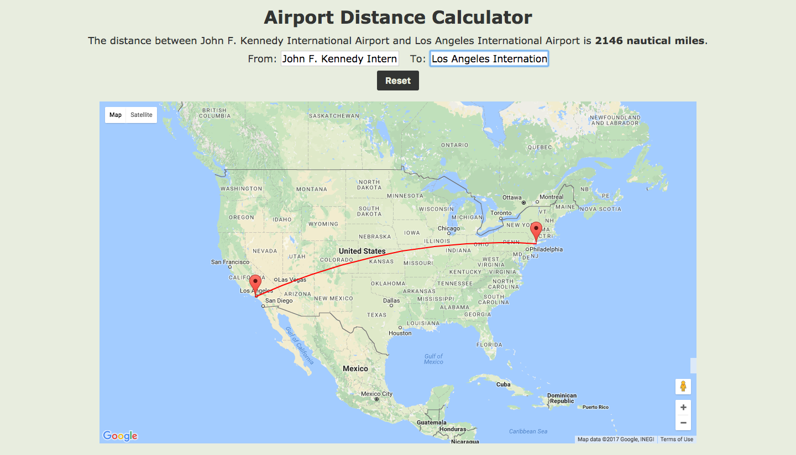

# Airport Distance Calculator

[Google Maps API]: https://developers.google.com/maps/
[Google Places API]: https://developers.google.com/maps/documentation/javascript/places

This calculator utilizes airport data gathered from the
[Google Places API] to calculate the distance in nautical miles
between two US airports.  A path between the two airports is drawn using
the [Google Maps API].

## How to Run

1.  Navigate to the project directory
2.  `npm run build`
3.  Open `index.html`

## Architecture & Technologies

This calculator utilizes the following technologies:

- jQuery for DOM manipulation
- jQuery UI for autocomplete input
- Google Places API for airport searching
- Google Maps API for map plotting
- Webpack to bundle JS files

This project contains the following library files:

- `entry.js` - entry file
- `app.js` - app logic
- `map.js` - Google Maps logic
- `util.js` - distance calculations
